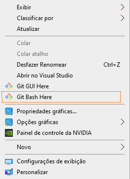
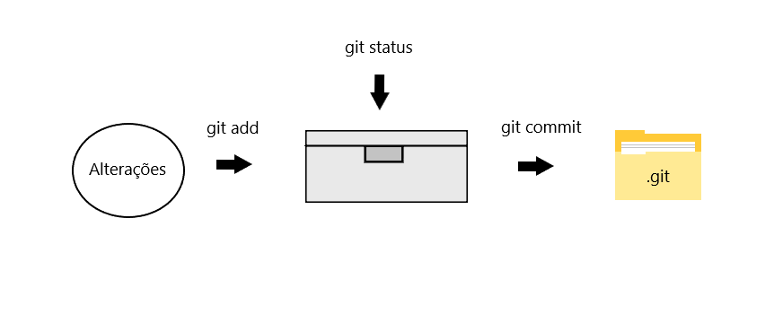
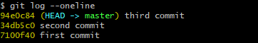
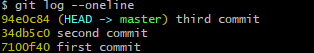
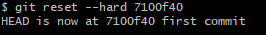
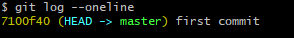
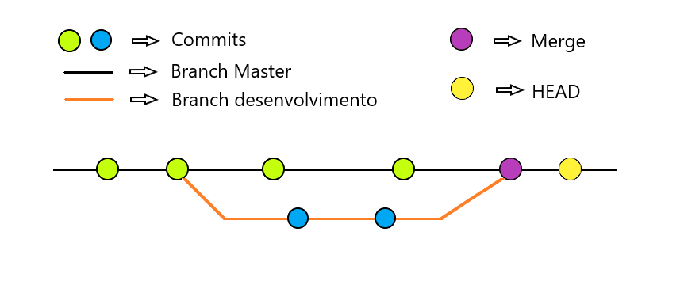

  <h1 align="center">
    
  </h1>
  <h3 align="center">Comandos básicos</h3>  
  
***
## <a name="indice">Índice</a> :link:
  1. [O que é o GIT ?](#o-que-e-git)
  2. [Instalando o GIT](#instalacao)
  3. [Configurando o GIT](#configurando)
  4. [Comandos básicos](#comandos-basicos)
  5. [Rastreando versões anteriores](#rastreando-versoes-anteriores)
  6. [Branchs / Ramificações](#ramificacoes)
  7. [Enviando projeto local para o GitHub](#enviando-repositorio-local)
  8. [Clonando repositórios](#clonando-repositorios)
  9. [Atualizando repositório local](#atualizando-repositorio-local)
***

## <a name="o-que-e-git">1. O que é GIT ?</a> :grey_question:
  O GIT é um sistema de gerenciamento de versões que armazena as mudanças realizadas em um projeto.  
  Com ele é possível recuperar versões anteriores desse projeto, que quando enviado para um repositório remoto, 
  nesse caso, o GitHub, sua equipe poderá trabalhar contigo nesse projeto.
    [Voltar ao índice](#indice)

## <a name="instalacao">2. Instalando o GIT</a> :computer:
  Para começar a utilizar o GIT é necessário instalá-lo em sua máquina local, acessando o próprio site
  da ferramenta na seção de downloads.
    
  [https://git-scm.com/downloads](https://git-scm.com/downloads)
    [Voltar ao índice](#indice)
  
## <a name="configurando">3. Configurando o GIT</a> :wrench:
  Após a instalação do git, clicando com o botão direito, selecione a opção `git bash here` como ilustrado na imagem abaixo.
  
   
  

    
  

   
  
  Após clicar, abrirá uma janela do git bash, então 2 comandos precisam ser executados uma única vez, sendo eles:
  - `git config --global user.name "<Seu nome>"`
  - `git config --global user.email "<Seu email>"`
  
  Com isso, seu nome e email já estarão configurados na sua máquina, e todos os commits que você realizar aparecerá essas
  informações para confirmar que foi você quem fez tais alterações, esse comando será abordado em seguida.
    [Voltar ao índice](#indice)
  
## <a name="comandos-basicos">4. Comandos básicos</a> :pencil2:
  Os comandos que serão apresentados são todos utilizados pelo terminal. Esses comandos funcionarão (exceto `git init`) se a 
  pasta/projeto atual estiverem sendo versionados, alguns comandos essenciais para trabalhar com versionamento são:
  
  - `git init`: Esse comando inicia uma pasta oculta com o nome de .git, com isso, se torna possível versionar o projeto
    localmente com o git e então utilizar a vasta quantia de comandos que o git dispõe.
    
  - `git add <nomeArquivo.extensao>`: O git add adiciona as alterações realizadas no projeto e as coloca em uma espécie de
    caixa/container, que irá guardar todas essas mudanças até que elas sejam "confirmadas". Digitando `*` ou `.` no lugar do 
    `<nomeArquivo.extensao>`, fará com que **todos** os arquivos que não estejam no arquivo `.gitignore` e que possuam alguma 
    alteração, sejam adicionados nesse "container".
    
  - `git reset`: Comando utilizado para retirar essas mudanças adicionadas pelo `git add`, caso alguma alteração
    tenha sido adicionada de forma equivocada.
  
  - `git status`: Este comando realiza a "consulta" e retorna o status atual do projeto, como por exemplo, se algum arquivo foi
    alterado e não executou o comando git add, se ja estão, entre outras informações.
  
  - `git commit -m "<Comentário>"`: O git commit é o comando que realiza a "confirmação" dessas mudanças adicionadas com o `git add`,
  passando junto um comentário para melhor entendimento do que foi alterado. Esse comando envia essas alterações para a pasta .git, e
  salvando-as com um código hash, único para aquele commit.
  
  - `git log`: É o comando que realiza a busca e mostra quem, quando e os comentários de todos os commits realizados até o momento no
    projeto, sendo possível também ver o código de cada commit. Ao utilizar a tag `--oneline` após o comando, é mostrado o log de forma
    mais simplificada.
    
    Imagem para ilustrar os comandos passados.
    
    

      
    

  
    [Voltar ao índice](#indice)
  
## <a name="rastreando-versoes-anteriores">5. Rastreando versões anteriores</a> :mag:
  Esses são comandos para "navegar" entre as versões do projeto, note que, a palavra HEAD ao lado do código hash indica em
  qual versão você se encontra no momento.
  
   
  

    
  

   
  
  - `git checkout <hash>`: Esse comando altera o projeto para a versão do código hash passado no lugar da palavra **hash**,
    que pode ser obtido pelo **git log --oneline**, com isso é possível voltar uma ou várias versões do projeto.
  
  - `git checkout master`: Esse comando retorna o projeto para a sua versão mais recente (último commit).
  
  - `git reset --hard <hash>`: O git reset deve ser utilizado com cautela, ele faz um papel semlhante ao git checkout, mas ao
    retornar o projeto para uma versão anterior utilizando esse comando, ele apaga os commit que estão "a frente" dele.
    
  Algumas imagens abaixo irão ilustrar o comando git reset Hard:
  
   
  

    
  

   
  
  

    
  

   
  
  

    
  

   
  
    [Voltar ao índice](#indice)
  
## <a name="ramificacoes">6. Branchs / Ramificações</a> :evergreen_tree:
  As branchs (ramificações), servem principalmente para realizar alterações em paralelo, podendo ser para testar uma funcionalidade
  antes de colocá-la no ramo de produção ou até mesmo para diversos membros da equipe desenvolverem diversas funcionalidades em paralelo.
  Sendo alguns desses comandos: 
  
  - `git branch`: Comando mostra em que branch você está.
  
  - `git checkout -b <nomeRamificação>`: Comando que cria uma nova nova ramificação no projeto.
  
  - `git checkout <nomeRamificação>`: Esse comando alterna entre as branchs, semelhante ao comando checkout com os códigos hashs.
  
  - `git merge <nomeRamificação>`: O comando de Merge (mesclar) une duas ramificações distintas, no caso, a branch que você se encontra
    com a que foi passada no comando no lugar de **nomeRamificação**.
    
  - `git branch -m <nomeAtual> <nomeDesejado>`: Esse comando renomeia a branch de <nomeAtual> para <nomeDesejado> por exemplo, alterar o nome
    da master para main.
    
  Ao realizar o merge de duas branchs, podem ocorrer conflitos, e as seguintes opções aparecerão:
  - **Accept current changes**: Mantém os arquivos pertencentes a branch atual.
  
  - **Accept incomming changes**: Mantém as alterações realizadas na branch passada em **nomeRamificação**.
  
  - **Accept both changes**: Aceita ambas as mudanças.
  
  - **Compare changes**: Compara as mudanças entre as branchs.
  
  E então, escolher a mais adequada para o momento, e continuar versionando o projeto.
  
  Imagem para ilustrar os comandos acima.
  
   
  

    
  

   
  
    [Voltar ao índice](#indice)
  
## <a name="enviando-repositorio-local">7. Enviando projeto local para o GitHub</a> :arrow_up:
  Ao versionar um projeto com GIT, esse processo ocorre em nossa máquina local, caso queira trabalhar em equipe, 
  guardar uma cópia desse projeto ou disponibilizá-lo em um repositório remoto, é necessário seguir alguns passos,
  sendo eles:
  
  - Verificar se um repositório remoto já está "vinculado" com o projeto.
  
  - Se não houver, criar um repositório remoto, nesse caso, no GitHub.
  
  - Vincular o repositório remoto com o projeto.
  
  Os passos acima podem ser realizados com os seguintes comandos:
  
  - `git remote`: Verifica se há um repositório remoto vinculado ao projeto.
  
  - `git remote add origin <URL>`: Vincula um repositório local com um remoto, através da URL fornecida.
  
  - `git push -u origin master`: Realiza o envio dos arquivos do repositório local para o remoto pela primeira vez.
  
  - `git remote -v`: Obtêm informações mais detalhadas sobre o repositório remoto.
  
    [Voltar ao índice](#indice)
  
## <a name="clonando-repositorios">8.Clonando repostitórios</a> :arrow_down:
  Também é possível criar um projeto no GitHub e cloná-lo para sua máquina local, então esse projeto já ficará vinculado
  ao repositório remoto de origem, ou seja, a URL do repositório clonado. Para fazer isso, abra o git bash no local do disco
  que deseja salvar o projeto e então digite o comando:
  
  - `git clone <URL>`: Irá baixar todos os arquivos presentes naquele repositório.
  
  - `git push`: Esse comando fará com que as mudanças realizadas no projeto local, sejam enviadas para o repositório remoto.
  
    [Voltar ao índice](#indice)
  
## <a name="atualizando-repositorio-local">9.Atualizando repositório local</a> :heavy_check_mark:
  Caso esteja trabalhando em equipe, você pode digitar o comando `git pull` para baixar as alterações presentes no repositório remoto,
  como um update.
  
  Espero ter conseguido mostrar de forma clara o funcionamento de alguns comandos em git, agradeço por ter lido!
  
    [Voltar ao índice](#indice)
